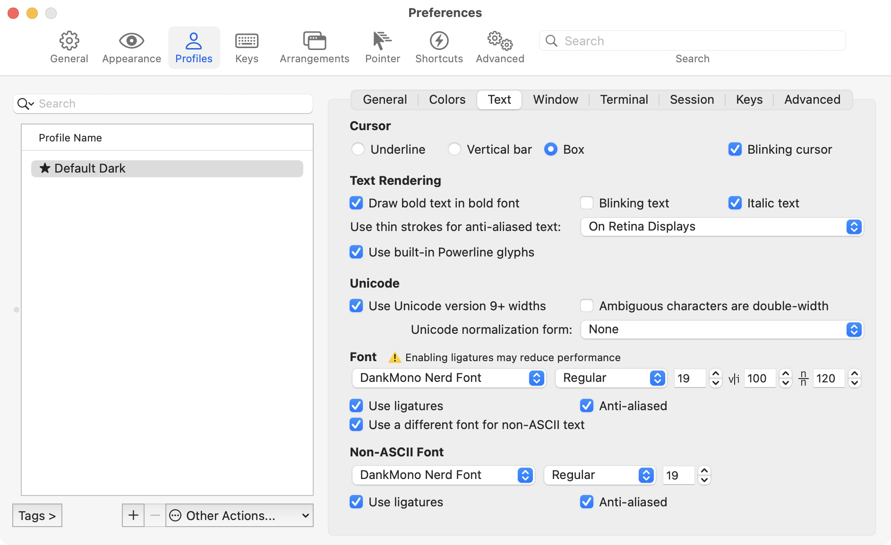

### [Ed Heltzel's](https://github.com/edheltzel) personal configuration for MacOS and Fish shell.

My playground revolves around DevOps and Full stack web development.

## 🧰 Terminal toolkit with replacements for [Unix commands](https://en.wikipedia.org/wiki/List_of_Unix_commands)

I find tools that are built with Rust or Go to be performant and cover 90% of my use cases.

- [bat](https://github.com/sharkdp/bat) Rust replacement for `cat`
- [bottom](https://clementtsang.github.io/bottom/0.8.0/) Rust replacement for `top`
- [Bun](https://bun.sh/) - A drop-in-replacement for NPM/PNPM/Yarn - written in Zig
- [eza](https://github.com/eza-community/eza) Rust replacement for `ls`
  - ~~[exa](https://the.exa.website/) Rust replacement for `ls`~~ - replaced with `eza`
  - [exa site](https://the.exa.website/) is still valid for **EZA** configurations
- [fd](https://github.com/sharkdp/fd) Rust replacement for `find`
- [fzf](https://github.com/junegunn/fzf) a mostly Go fuzzy finder
- [procs](https://github.com/dalance/procs) Rust replacement for `ps`
- [ripgrep](https://github.com/BurntSushi/ripgrep) Rust replacement for `grep`
- [sd](https://github.com/chmln/sd) Rust replacement for `sed`
- [starship](https://starship.rs/) Rust prompt
- [tealdeer](https://github.com/dbrgn/tealdeer) Rust replacement for `man`
- [topgrade](https://github.com/topgrade-rs/topgrade) Rust replacement for package manager updates
- [zoxide](https://github.com/ajeetdsouza/zoxide) Rust companion for `cd` and replacement for z and auto jump
  - [zoxide fish](https://github.com/kidonng/zoxide.fish) - Fish plugin for zoxide

## ⚙️ Usage and the Install

**Caveats**
If you are on any version of macOS that uses AFPS, you'll need to disable the SIP.
First check to see if SIP is enabled or not.

```shell
csrutil status
```

output should read:

```shell
System Integrity Protection status: enabled.
```

If your SIP is enabled, then follow the next steps to disable it – Assuming that you know what you're doing, here is how to turn off System Integrity Protection on your Mac.

1. Turn off your Mac (Apple > Shut Down).
2. Hold down Command-R and press the Power button. Keep holding Command-R until the Apple logo appears.
3. Wait for OS X to boot into the OS X Utilities window.
4. Choose Utilities > Terminal.
5. Enter csrutil _disable_.
6. Enter reboot.
7. `csrutil status` -> should read `System Integrity Protection status: disabled.`

### SSH Keys
I use [ssh keys](https://help.github.com/articles/generating-a-new-ssh-key-and-adding-it-to-the-ssh-agent/) to authenticate with GitHub and other services. You generally want to create new keys for each device you use, but you can also use the same key on multiple devices. **I have started using two different keys for my multi-machine work flow.** One key is for my personal devices and the other is for my work devices. This allows me to easily revoke access to my work devices if I discontinue a relationship with a company or customer, and not have to worry about my personal keys being compromised or having to change them.

If you look at the `.gitconfig` you'll see the use of two different keys.

1. Restore your safely backed up ssh keys to `~/.ssh/`

  - I personally use Dropbox to keep these keys and configuration in sync with my devices, it's not ideal but works for me:
      - `touch ~/Dropbox/.ssh-config && ln -s ~/Dropbox/.ssh-config ~/.ssh/config`
    -  Again you can alternatively, [generate new ssh keys](https://help.github.com/articles/generating-a-new-ssh-key-and-adding-it-to-the-ssh-agent/), and add these to your GitHub account.

2. Clone this repository

```
git clone git@github.com:edheltzel/dotfiles.git
```

3. Run the `bootstrap.sh` script
   1. Alternatively, only run the `setup.sh` scripts in specific subfolder if you don't need everything - You must start with the `./packages/.setup.sh` script first. This will prevent any installation errors.
4. Install [Fisher](https://github.com/jorgebucaran/fisher) and Plugins -- _Optional_

```bash
curl -sL https://git.io/fisher | source && fisher install jorgebucaran/fisher
fisher
```

## 🏗️ Customization

I would encourage you to play around with the configurations so you can add or remove features.
If you would like to use these dotfiles for yourself, I'd recommend changing following:
- #### Git

  - The `.gitconfig` file includes my `[user]` config, replace these with your own user name and email as well as the `[include]` path for your local gitconfig.
    - Almost all of git aliases are located in `.gitconfig` versus `_aliases.fish` or `fish/functions/setup.fish` - I've found this to work best for me.
  - Also check the `.gitignore_global` for anything you might want to add or remove.

- #### OSX

  - At the top of the setup.sh file, my computer name is set as `MacDaddy` - might want to change it.

- #### Packages

  This folder is a collection of the programs and utilities I use. The lists can easily be amended for your workflow.

  - `Brewfile`
  - `python_packages.txt`
  - `ruby_packages.txt`
  - `rust_packages.txt`
  - `pnpm_packages.txt`

  > If you would rather run each text file individually, you can run the following command as an example:

  > Fish 👉 `pnpm add --global (cat pnpm_packages.txt)`<br>
  > Bash 👉 `pnpm add --global $(cat pnpm_packages.txt)`

- #### Repos

  This folder is a collection of repos I like to sync between my machines. The lists can easily be amended for your workflow. Just add the repo name to the `txt` file and it will be cloned. To customize, just update the name of the `oss.txt` file to match the name of the directory you want these repos to be cloned to.

  - `oss.txt` - My personal OSS projects that I like to keep in sync

## 📝 Contents

### Root (/)

- bootstrap.sh - Calls all setup.sh scripts and executes.

### Config (config/)

setup.sh - Symlinks all `.files` to their corresponding location in `~/.config/`

- bat/
- iterm/
- raycast/
- utils/
- vscode/
- .ackrc
- .gemrc
- .gitnow
- .hushlogin
- .nirc
- .npmrc
- .profile
- .tigrc
- .tmux.conf
- .vsce
- .wgetrc
- .zhsenv
- .zshrc
<details>
  <summary>text settings iTerm</summary>
  
</details>


### Duti (duti/)

- setup.sh - Sets the default app for the different file extensions.
- `app.package.id` - Contains all extensions for the specified program _(run `tldr duti` OR `man duti` to learn more)_

### Fish (fish/)

- setup.sh - Symlinks all fish files to their corresponding location in `~/.config/fish/`
- config.fish - Global fish configuration _(.fishrc)_
- `fish_plugins` - list of [Fisher](https://github.com/jorgebucaran/fisher) plugins to install
- `completions/`
  - alacritty.fish - Contains all completions for the `alacritty` command
  - tmuxinator.fish - Contains all completions for the `mux` command
- `conf.d/`
  - abbr.fish - Contains all abbreviations
  - colors.fish - Contains all color definitions
  - exports.fish - Contains all exports
  - fnm.fish - Contains all fnm completions
  - paths.fish - Contains all paths
  - tmux.fish - Contains all tmux completions
  - variables.fish - Contains all variables ie: `$EDITOR`

- `functions/`
  - _aliases.fish - Contains all aliases
  - _utils.fish - Contains special scripts
  - abbrex.fish - Utility for expanding abbreviations in fish-scripts
  - btm.fish - Runs [btm]
  - cd.fish - Changes directory and lists contents
  - cp.fish - Copies files and directories
  - cpwd.fish - Copies the current working directory to the clipboard
  - fish_greeting.fish - My personal fish greeting using the full-color fish logo
  - git-undo.fish - Undo a the last commit message and reset the HEAD
  - imgcon.fish - Converts images to different formats
  - mkbak.fish - Creates a backup of a file
  - mkd.fish - Creates a directory and changes into it
  - pubkey.fish - Copies the public key to the clipboard
  - reload.fish - Reloads fish
  - restore.fish - Restores a file from a backup
  - ~~setup.fish - reloads and sets fish abbreviations~~ - **DEPRECATED** - use `abbr -a` inside of `conf.d/abbr.fish` instead
  - upp.fish - **macOS ONLY** checks current global node version and runs `topgrade` command
  - weather.fish - using wttr.in to check the local weather
  - wget.fish - alias for `wget -c`
  - speed.fish - **macOS ONLY** leverages the built-in `networkQuality` cli tool - just a glorified alias but works with all the flag options

<details>
  <summary><code>speed summary</code></summary>
<pre>
> speed
==== SUMMARY ====
Uplink capacity: 232.603 Mbps (Accuracy: High)
Downlink capacity: 887.549 Mbps (Accuracy: High)
Responsiveness: Medium (570 RPM) (Accuracy: High)
Idle Latency: 32.708 milliseconds (Accuracy: High)
Interface: en0
Uplink bytes transferred: 363.870 MB
Downlink bytes transferred: 1.987 GB
Uplink Flow count: 20
Downlink Flow count: 16
Start: 8/27/23, 5:32:12 PM
End: 8/27/23, 5:32:32 PM
OS Version: Version 13.5.1 (Build 22G90)
</pre>
</details>

#### Update All The Things

- using [Topgrade by r-darwish](https://github.com/r-darwish/topgrade) -- see `prompt > topgrade.tmol` for config options.
- a fish function exist `upp` to check current global node version and to run the `topgrade` command

### Git (git/)

- setup.sh - Symlinks all git files to `~/`
- .gitignore_global - Contains global gitignores, such as OS-specific files and
  several compiled files
- .gitconfig - Sets several global Git variables - also include GPG signing

#### Commit and Tag Signing

##### SSH Commit Signing

> This is the my preferred way setup for Git Commit/Tag Signing. Using your SSH key "simplifies signing Git commits and tags" on both Github and Gitlab. This is a great way to secure your commits and verify that you are the one making the commits, without all the setup and maintaining hassle GPG can come with. IDK why but sometimes it just stops working ¯\_(ツ)_/¯

- [Git Merge Workshop - Simplify Signing with SSH](https://github.com/git-merge-workshops/simplify-signing-with-ssh/tree/main)
- [Gitlab SSH Commit Signing Doc](https://docs.gitlab.com/ee/user/project/repository/ssh_signed_commits/)

The `.gitconfig` includes a line that adds support for an additional gitconfig file `.gitconfig.local` - my personal setup uses two different Macs and this is how I achieve commit signing with each machine.
  ```shell
    [meta]
      isLocalConfig = true
    [user]
      signingkey = PATH_TO_YOUR_KEY
    [gpg "ssh"]
      allowedSignersFile = PATH_TO_YOUR_ALLOWED_SIGNERS_FILE
  ```
  - **PLEASE REVIEW** `./git/setup.sh`, this script checks what the computer name is and sets the `.gitconfig.local`, you'll want to update this to your computer name.

##### GPG Commit Signing

  _(optional)_: GPG signing is set to `TRUE` by default 👉 If you **DO NOT** want to enable GPG run `git config --global commit.gpgsign false` and remove the GPG packages from the [Brewfile](https://github.com/edheltzel/dotfiles/blob/master/packages/Brewfile).

  [renew expired gpg](https://gist.github.com/krisleech/760213ed287ea9da85521c7c9aac1df0)

  [Generate new key and assign to global git config](https://gist.github.com/paolocarrasco/18ca8fe6e63490ae1be23e84a7039374#:~:text=It%20means%20that%20is%20not,secret%20keys%20available%20in%20GPG.)

  main take away:

  - `gpg --list-secret-keys --keyid-format=long`
  - Copy key
  - set key for your git user
    - `git config --global user.signingkey <your key>`

  git config --global user.signingkey <your key>

  - 
  - If you need help setting this up GPG:
    - follow the Github article for [Signing Commits](https://help.github.com/en/articles/signing-commits) to set up you GPG key(s).
    - I found this [GIST helpful](https://gist.github.com/cezaraugusto/2c91d141ddec026753051ffcace3f1f2)
    - To get VSCode setup follow this [article](https://dev.to/devmount/signed-git-commits-in-vs-code-36do)
  - **Please Note** if you used the [Brewfile](https://github.com/edheltzel/dotfiles/blob/master/packages/Brewfile), Cask installed the macOS [GPG Suite](https://gpgtools.org/) via `cask 'gpg-suite-no-mail'` -- _(alternatively)_ update the [Brewfile](https://github.com/edheltzel/dotfiles/blob/master/packages/Brewfile) with `cask 'gpg-suite' to include GPGMail.

### macOS Preferences (macos/)

- setup.sh - Executes a long list of commands pertaining to macOS Preferences
  - **I can not stress enough to read this and change this for what works for you.**
  - **DO NOT** blindly run this script - it is a WIP with each macOS update things change.

### Misc Dotfiles (misc/)

- setup.sh - Symlinks all the associated rc and other dot files to your `~/` _(home directory)_
- Special Mentions:
  - `.tigrc` - [tig](https://jonas.github.io/tig/) – configured with pretty colors and layout for git diff and logs
  - `.eslintrc` - has specific configuration for my JS workflow
  - `bat/config` - [bat](https://github.com/sharkdp/bat) – a clone of cat with syntax highlighting
  -

### Packages (packages/)

- setup.sh - Installs the contents of the package manager files and the Brewfile

### Repositories (repos/)

- setup.sh - Clones the repositories in the `` files at the corresponding
  locations

### Vim (nvim/)

I use NeoVim, when I need Vim. The distribution I use is [LazyVim](https://www.lazyvim.org/)

- setup.sh - Clone LazyVim to `~/.config/nvim`

### Helper Scripts (scripts/)

- functions.sh - Contains helper functions for symlinked files and printing
  progress messages
### Node development

Node Version switching for Node development, takes advantage of [fnm](https://github.com/Schniz/fnm) for managing Node versions, which supports both `.nvmrc` and `.node-version` files.

- Install happens in the `Brewfile` by running

```shell
brew install fnm
```

For Completions run:

```shell
fnm completions --shell fish
```

Make sure you run:

```shell
./fish/./setup.sh
```

This will symlink the `fnm.fish` file in `~/.config/fish/conf.d` _(It might be helpful to `source ~/.config/fish/config.fish`)_

**Note:** FNM has the ability to auto switch Node versions if there is a `.node-version` or `.nvmrc` file - this is enabled by default

```shell
# automatically run fnm use
fnm env --use-on-cd | source
```

> Please note that when you change your default Node version, you will need to run `npm install --global (cat node_packages.txt)` to include `corepack` in the global packages. This will ensure that `pnpm` and `yarn` are available.

#### 🙏 Special Thanks

Gotta thanks to [kalis.me blog post](https://kalis.me/dotfiles-automating-macos-system-configuration/) for the simple setup, and inspiration.
