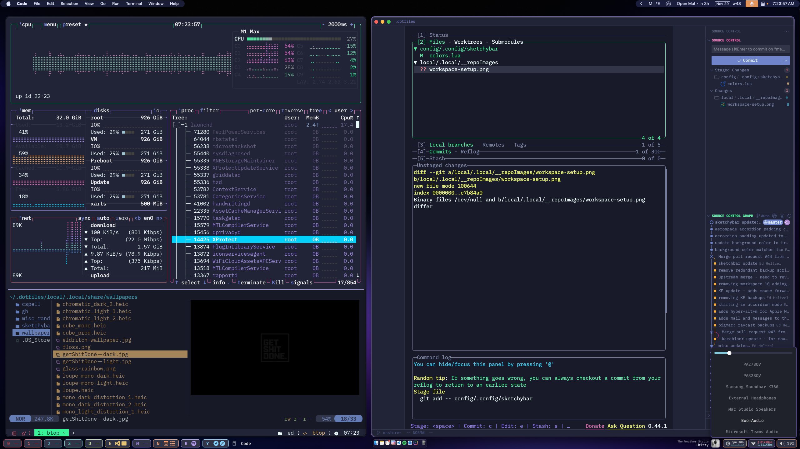
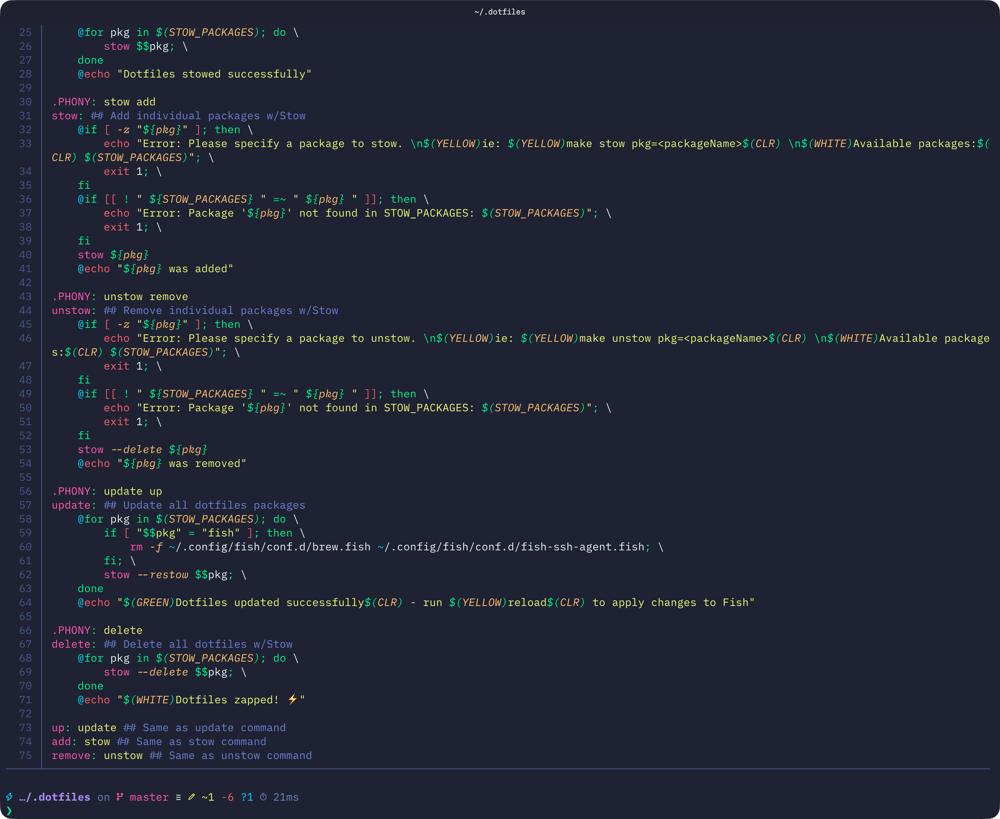
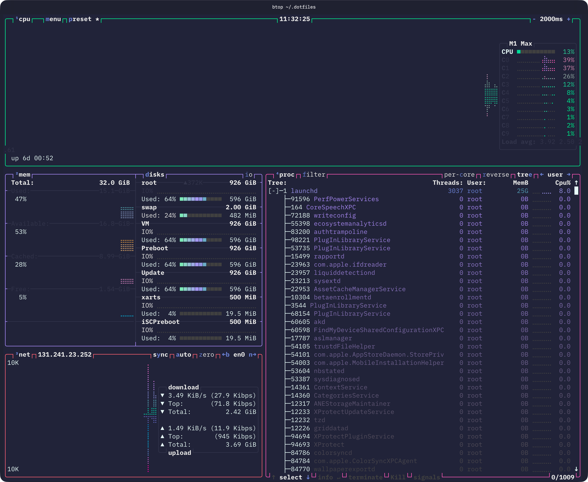
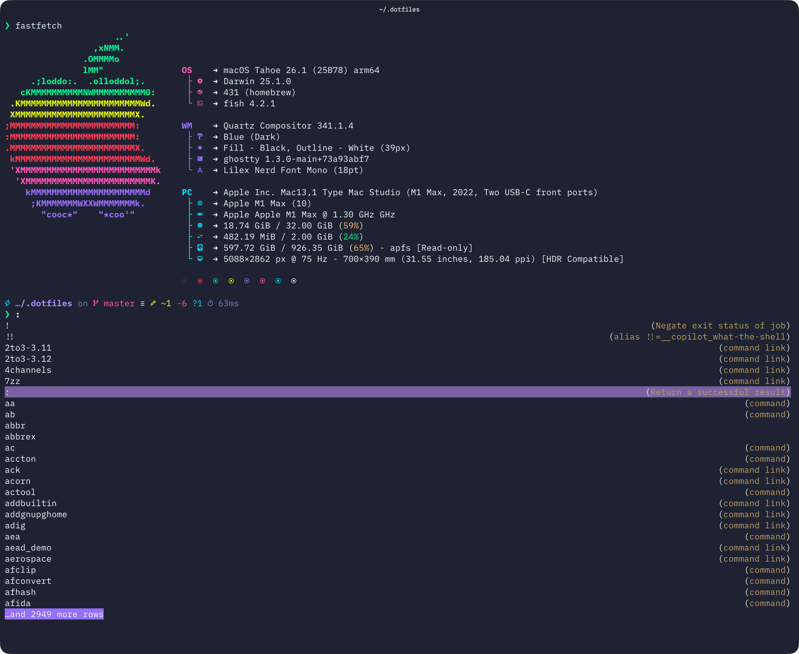
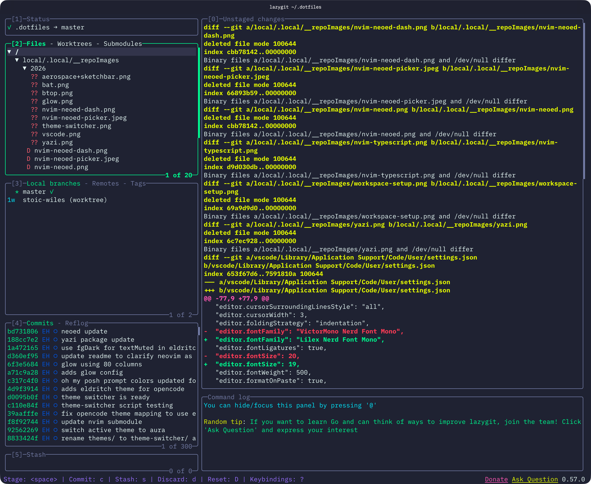
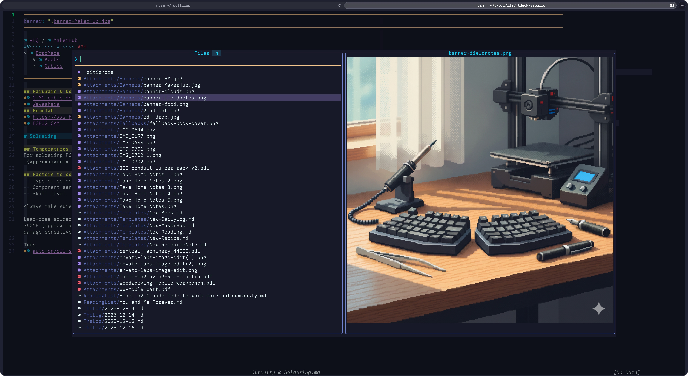
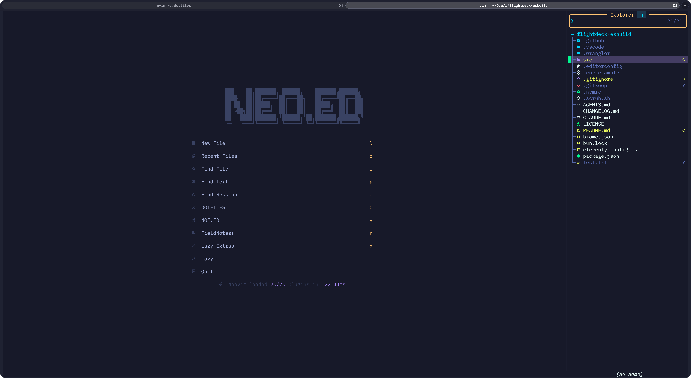
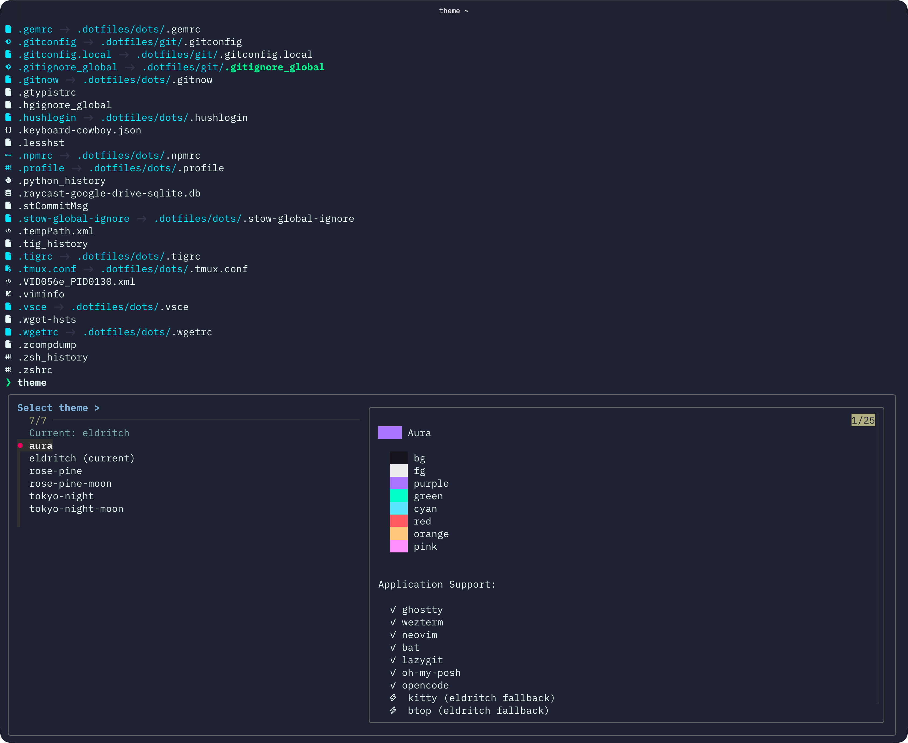
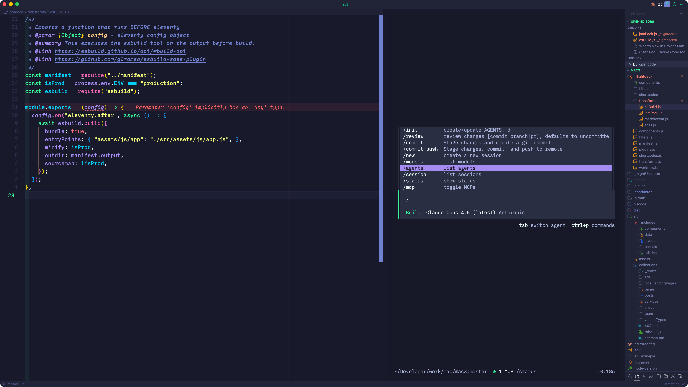
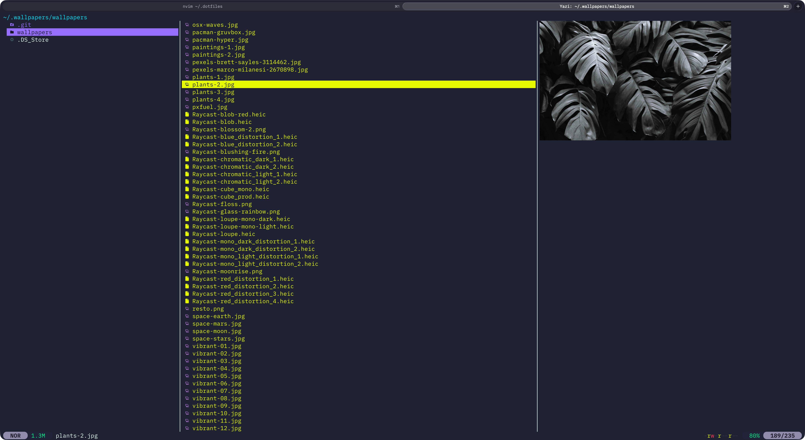

```
███████╗   ██████╗  ██████╗ ████████╗███████╗
██╔════╝   ██╔══██╗██╔═══██╗╚══██╔══╝██╔════╝
█████╗     ██║  ██║██║   ██║   ██║   ███████╗
██╔══╝     ██║  ██║██║   ██║   ██║   ╚════██║
███████╗██╗██████╔╝╚██████╔╝   ██║   ███████║
╚══════╝╚═╝╚═════╝  ╚═════╝    ╚═╝   ╚══════╝
```

# E.Dots

> [!NOTE]
> EdHeltzel's Dotfiles

### My personal setup for 🐠 Fish shell on  macOS - `v3`

Hey there 👋, I'm EdHeltzel and you've found my dotfiles setup for working with [fish shell](https://fishshell.com/) on  macOS, managed with [GNU Stow](https://www.gnu.org/software/stow/). You'll also find the scripts I use to provision a new machine. [Neovim](https://neovim.io/) (via [NEO.ED](https://github.com/edheltzel/neoed)), [WezTerm](https://wezterm.org), [Herdr](https://herdr.dev/), and [Oh-My-Pi](https://omp.sh/) make up my ADE (AI/Agent Development Environment). The Zed config is kept for occasional use and is not part of the regular workflow.

> [!WARNING]
> This is my personal setup and **changes often**. Don't blindly fork and run `install.sh` without reading it first. The script uses subcommands - see `./install.sh help`.

But get **inspired**, take what you want, and leave the rest to make it your own.

- [NEO.ED - Neovim Config](https://github.com/edheltzel/neoed)
- [E.Defy - Dygma Defy keyboard](https://github.com/edheltzel/DygmaDefy)

| Screenshots | Screenshots |
| --- | --- |
|  |  |
|  |  |
|  |  |
|  |  |
|  |  |

<details>
  <summary>Different Versions</summary>

- [v1](https://github.com/edheltzel/dotfiles/tree/v1) uses oh-my-zsh (very old)
- [v2](https://github.com/edheltzel/dotfiles/tree/v2) uses fish shell + custom scripts (old)
- v3 uses fish shell + GNU Stow
- [v3.2](https://github.com/edheltzel/dotfiles/tree/v3.2) adds the Zsh mirror config
- [v3.3](https://github.com/edheltzel/dotfiles/tree/v3.3) Vite+ replaces Biome in Neovim, LeaderKey replaces Karabiner
- [v3.4](https://github.com/edheltzel/dotfiles/tree/v3.4) Claude Code OMP statusline, gh-board, lazyworktree
- [v3.5](https://github.com/edheltzel/dotfiles/tree/v3.5) superfile, `aup` harness updater, Starship as primary prompt, `tuicr` pager (current)

Full history lives in [CHANGELOG.md](./CHANGELOG.md).

</details>

## Table of Contents

- [Prerequisites](#prerequisites)
- [For future Mr EdHeltzel](#-for-future-mr-edheltzel)
- [The Nitty Gritty](#the-nitty-gritty)
- [Stow Packages](#stow-packages)
- [Scripts](#scripts)
- [macOS Mods](#macos-mods)
- [Troubleshooting](#troubleshooting)
- [TODOs](#todos)
- [Agent docs](#agent-docs)

## Prerequisites

<details>
  <summary><strong>Install with a single line...</strong></summary>

I have not tested this on a fresh install, so this could break your setup. Read `install.sh` and the `justfile` before running it.

In theory, this clones the repository to `~/.dotfiles`, then bootstraps the machine. Again, in theory.

```shell
bash -c "$(curl -fsSL https://raw.githubusercontent.com/edheltzel/dotfiles/master/install.sh)" -- bootstrap
```

The remote-curl invocation detects that it is running outside a cloned repo, clones itself to `~/.dotfiles`, then re-executes with the `bootstrap` subcommand. If you prefer, clone first and run locally:

```shell
git clone --recurse-submodules https://github.com/edheltzel/dotfiles.git ~/.dotfiles
cd ~/.dotfiles && ./install.sh bootstrap
```

</details>

<details>
  <summary>Resources & Inspiration</summary>

Below are the resources I used to get to this point in my setup.

- [dotfiles.github.io][ThanksGithub]
  - [utilities][ThanksGHUtils]
  - [inspiration][ThanksGHInspiration]
- [kalis.me blog post][ThanksKalis]
- [Lissy93 dotfiles][ThanksLissy]
- [jakewiesler.com blog post][ThanksJake]

</details>

<details>
  <summary>My Equipment - Keyboards & Trackballs</summary>

I collect, build, and use different ergonomic keyboards and trackballs. Generally I'm running some kind of ergonomic split keyboard with the trackball in between.

- [Dygma Defy](https://dygma.com/products/dygma-defy) - daily driver ❤︎
- [Keychron Q11](https://www.keychron.com/products/keychron-q11-qmk-custom-mechanical-keyboard)
- [Lily58 Pro](https://github.com/kata0510/Lily58)
- [Ergodox 76 Hot Dox v2](https://apos.audio/products/ergodox-76-hot-dox-v2-mechanical-keyboard)
- [Corne v4.1](https://github.com/foostan/crkbd)
- [Cheapino](https://github.com/tompi/cheapino)
- [Keychron Q10](https://www.keychron.com/products/keychron-q10-alice-layout-qmk-custom-mechanical-keyboard)
- [Daskeyboard 4 Pro](https://www.daskeyboard.com/daskeyboard-4-professional-for-mac/)

**Trackballs**:

- [Elecom Deft Pro](https://elecomusa.com/products/deft-pro-trackball-copy-1)
- [Kensington Expert Mouse](https://www.kensington.com/p/products/electronic-control-solutions/trackball-products/expert-mouse-wireless-trackball-1/)
- [Ploopy Thumb](https://ploopy.co/thumb-trackball/)

Layout backups live in `local/.local/share/keyboards-mouse/`.

</details>

<details>
  <summary><em>Caveats for non-Apple Silicon (Intel)</em></summary>

If you are on any version of macOS that uses APFS, you'll need to disable SIP. First check whether SIP is enabled:

```shell
csrutil status
```

The output should read:

```shell
System Integrity Protection status: enabled.
```

If SIP is enabled, follow these steps to disable it. Assuming you know what you're doing:

1. Turn off your Mac (Apple > Shut Down).
2. Hold down Command-R and press the Power button. Keep holding Command-R until the Apple logo appears.
3. Choose Utilities > Terminal.
4. Wait for macOS to boot into the Utilities window.
5. Enter `csrutil disable`.
6. Enter `reboot`.
7. `csrutil status` should now read `System Integrity Protection status: disabled.`

</details>

## 👋 For future Mr EdHeltzel

Since we have a bad habit of forgetting things - see [Troubleshooting](#troubleshooting):

1. Install Xcode Command Line Tools: `sudo softwareupdate -i -a && xcode-select --install`. This installs `git` and `make` if not already present.
2. Generate SSH keys and add them to GitHub:
   - [Generate a new ssh key](https://docs.github.com/en/github/authenticating-to-github/generating-a-new-ssh-key-and-adding-it-to-the-ssh-agent)
   - `ssh-keygen -t ed25519 -C "you@host" -f ~/.ssh/id_ed25519` - auth key
   - `ssh-keygen -t ed25519 -N "" -C "git signing" -f ~/.ssh/id_signing` - signing key, no passphrase
   - Add `id_ed25519.pub` to GitHub as **Authentication**, `id_signing.pub` as **Signing**
   - `ssh-add --apple-use-keychain ~/.ssh/id_ed25519`
3. Clone the repo with submodules:
   - `git clone --recurse-submodules https://github.com/edheltzel/dotfiles.git ~/.dotfiles`
   - Or if already cloned: `cd ~/.dotfiles && git submodule update --init --recursive`
4. Use the `justfile` for the rest of the setup:
   - `cd ~/.dotfiles && just install` (calls `./install.sh bootstrap`)
   - Or invoke the script directly: `./install.sh bootstrap`
   - For stow-only (no software install): `./install.sh link` or `just link`
   - The install script initializes git submodules for you
5. After setup completes, run `upp` to execute topgrade and update everything:
   - `upp` is an abbreviation for `topgrade --yes` - Update Packages _(this is what I say to myself)_
   - `config/.config/topgrade.toml` includes `[post_commands]` for a Brew cleanup pass
   - `aup` updates the AI agent harnesses listed in `fish/.config/fish/agent-harnesses.txt`
6. Optional DX and nice to haves:
   - Disable Gatekeeper when installing apps: `sudo spctl --master-disable` (see `macos/03-security.sh`)
   - Node auto-switching is lazy-loaded; `fnm env --use-on-cd` runs on the first `node`/`npm` call
7. Wallpapers live in `~/.wallpapers/`, which has its own [repo](https://github.com/edheltzel/wallpapers). [Raycast](https://www.raycast.com/) uses that directory to set wallpapers.

## The Nitty Gritty

Originally I used a series of custom scripts to create symlinks, and it worked, but I've since switched to [GNU Stow](https://www.gnu.org/software/stow/). Way easier to manage.

With Stow I added a `justfile` that I treat like NPM scripts. You need to be in the root of `~/.dotfiles` to run any `just` recipe. `just --list` is the source of truth; at the time of writing:

```shell
default       Show available recipes (default)
install       Bootstrap a new machine (full provision) [alias: bootstrap]
link          Symlink all dotfiles with Stow (idempotent) [alias: run]
list          List available stow packages
stow          Add individual package with Stow (e.g., just stow fish) [alias: add]
unstow        Remove individual package with Stow (e.g., just unstow fish) [alias: remove]
update        Restow all dotfiles packages [alias: up]
delete        Remove all dotfile symlinks
hooks         Install tracked .githooks into .git/hooks
```

**Bootstrapping**

`just install` calls `./install.sh bootstrap`. The unified installer has two primary subcommands:

- `./install.sh bootstrap` - provision a new machine: Xcode CLT, Homebrew + Brewfile, language package managers (FNM, rbenv, rustup, Bun), Stow, duti, macOS prefs, git config, optional fish as default shell.
- `./install.sh link` - symlink dotfiles only (idempotent). Use this when the machine is already set up.

Flags for `bootstrap`: `-y`/`--yes` (skip prompts), `--no-packages` (skip Homebrew bundle and language package managers), `--no-macos` (skip system preferences). Run `./install.sh help` for full usage.

**Stowing/Unstowing (add/remove)**

Two options for managing packages with GNU Stow:

1. Use Stow directly from the repo root: `stow fish`, `stow --restow fish`, or `stow -D fish` _(unstow)_
2. Use the justfile: `just stow fish` or `just unstow fish`

`just update` restows everything. It also clears stale `brew.fish`/`fish-ssh-agent.fish` symlinks and zsh completion dumps first.

**Git hooks**

`just hooks` installs wrappers in `.git/hooks` that call the tracked `.githooks/pre-commit` (blocks direct commits to `master`, runs `shellcheck` on staged shell) and `.githooks/commit-msg` (Conventional Commits). It deliberately does **not** set `core.hooksPath`, because GitButler writes its own wrappers there.

## Stow Packages

The package list is `stow_packages` in the `justfile`: `dots git fish zsh config neovim local`.

- **dots** (`dots/`) - misc dotfiles that live directly in `$HOME`: `.npmrc`, `.tmux.conf`, `.biome.json`, `.tigrc`, `.gitnow`, `.profile`, etc. Also owns `.stow-global-ignore`, the shared ignore list used by every package without its own.

- **git** (`git/`) - `.gitconfig` (aliases, delta pager, SSH signing), `.gitignore_global`, and `git.sh`, which symlinks the machine-specific `~/.gitconfig.local` keyed on `ComputerName` and registers the signing key on GitHub. List aliases with `git config --get-regexp '^alias\.'`.

- **fish** (`fish/`) - primary shell, XDG-compliant so `$HOME` stays clean (XDG vars are set in `conf.d/paths.fish`).
  - **Prompt**: `FISH_PROMPT` in `config.fish` selects the prompt engine. Starship is the default; the config is `config/.config/starship.toml` and shows the GitButler stack via a vendored `starship-gitbutler` module.
  - **Secrets**: API keys live in `conf.d/secrets.fish` (gitignored). Create it from the template: `cp fish/.config/fish/conf.d/secrets.fish.example fish/.config/fish/conf.d/secrets.fish`. Used by the `claude-models` function among others.
  - **Lazy-loading**: heavy tools initialize on first use. `config.fish` defines wrapper functions for `node`/`npm`/`npx` (FNM) and `ruby`/`gem`/`bundle`/`rake`/`irb` (rbenv) that init the tool once, erase themselves, and delegate. `conf.d/zoxide.fish` wraps `z`/`zi` with a persistent wrapper (zoxide is initialized with `--no-cmd` so it does not overwrite the wrapper) that runs `__list_dir` after each jump. `npx` delegates to `bunx`.
  - **Shared directory listing**: `functions/__list_dir.fish` holds the single set of `eza` flags used after every directory change. `cd`, `z`, and `zi` all call it.
  - **Abbreviations, not aliases**: `conf.d/abbr.fish`. Run `abbr` to list them. Multi-step commands live in `functions/`.
  - **Plugins**: managed by [Fisher](https://github.com/jorgebucaran/fisher), listed in `fish_plugins`.
  - **SSH agent**: `conf.d/fish-ssh-agent.fish` shares one agent across every shell (see Troubleshooting).
  - **Agent harnesses**: `functions/aup.fish` updates the AI CLIs listed in `agent-harnesses.txt`.

- **zsh** (`zsh/`) - near-identical mirror of the Fish config for Zsh compatibility. XDG-compliant (`ZDOTDIR=~/.config/zsh`).
  - **Plugin manager**: [Antidote](https://getantidote.github.io/), plugins in `.zsh_plugins.txt`: `zsh-autosuggestions`, `fast-syntax-highlighting`, `zsh-abbr`, `zsh-history-substring-search`, `zsh-autopair`, `zsh-completions`.
  - **Modular**: `.zshrc.d/` numbered files load in order (`01-paths` through `12-lazy-zoxide`), mirroring Fish's `conf.d/`.
  - **Lazy-loading**: FNM, rbenv, and zoxide load on first use.
  - **Secrets**: `secrets.zsh` (gitignored), copy from `secrets.zsh.example`.
  - **Prompt**: `ZSH_PROMPT` (set in `secrets.zsh`), Starship by default.
  - **Functions**: 30+ autoloaded functions in `functions/`, the same set as Fish (`theme`, `reload`, `flashEthernet`, ...). Custom completions in `completions/`.

- **config** (`config/`) - `~/.config` for 20+ applications, so they don't clutter the repo root. Currently: bat, borders, btop, fastfetch, gh, gh-changelog, gh-dash, ghostty, herdr, jj, karabiner, kitty, lazygit, leaderkey, markdownlint-cli2, raycast, starship, superfile, theme-switcher, topgrade, wezterm, zed.
  - **Terminals**: WezTerm (primary, modular Lua, see [its README](./config/.config/wezterm/README.md)), Kitty, Ghostty.
  - **Theme switcher**: run `theme` for an fzf picker with preview, `theme <name>` to switch directly, `theme --list` / `--current`. Twelve themes (Eldritch, Tokyo Night, Rosé Pine x3, Vesper, Catppuccin x4, Dracula, Gruvbox) applied across Ghostty, Kitty, WezTerm, Neovim, bat, btop, lazygit, oh-my-posh, Claude Code, Yazi, herdr, and gh-dash. Details in [theme-switcher/README.md](./config/.config/theme-switcher/README.md).
  - **Keyboard**: `leaderkey` (current) and `karabiner` (legacy TypeScript config, see [its README](./config/.config/karabiner/README.md)).
  - **Editors**: `zed` (Vim mode), kept for occasional use.

- **neovim** (`neovim/`) - **git submodule** for [NEO.ED](https://github.com/edheltzel/neoed), my LazyVim-based config and primary editor. Stow symlinks `~/.config/nvim` to `neovim/.config/nvim/`. See [its README](./neovim/.config/nvim/README.md) for the full story; highlights: Vite+ formatting and linting (Oxfmt/Oxlint), Eldritch colorscheme, AI integration (Claude Code, OpenCode, Pi), multi-language support.

- **local** (`local/`) - `~/.local`: `bin/` scripts (`chshell`, `update-wezterm-nightly`), cspell dictionaries, keyboard/mouse layout backups, and GitHub CLI extensions (`gh-board`, `gh-changelog`, `gh-dash`, `gh-enhance`, `gh-markdown-preview`, `gh-stack`). Repo screenshots in `__repoImages/` are excluded from stow.

## Scripts

These are run by `install.sh bootstrap` but can be run on their own. They source `../scripts/functions.sh` by relative path, so run each from its own directory: `cd ~/.dotfiles/duti && ./duti.sh`.

- **macOS** (`macos/`) - `macos.sh` runs `01-preferences.sh`, `02-apps.sh`, and `03-security.sh`. **Do not** blindly run this; it is a WIP and every macOS update changes something.

- **packages** (`packages/`) - `packages.sh` installs (and uninstalls) the Brewfile plus each package manager's manifest.
  - Usage: `./packages.sh [action] [target]`, actions `install` (default) / `uninstall`, targets `brew`, `node`, `bun`, `pnpm`, `ruby`, `rust`, `all`.
  - Manifests: `Brewfile`, `node_packages.txt`, `bun_packages.txt`, `ruby_packages.txt`, `rust_packages.txt`. Bun owns global JavaScript CLIs; there is currently no `pnpm_packages.txt`, so skip the `pnpm` target.

  ```fish
  ./packages.sh                  # install everything (default)
  ./packages.sh bun              # install just Bun globals
  ./packages.sh uninstall bun    # remove every pkg in bun_packages.txt
  ./packages.sh uninstall all    # remove everything (reverse order; brew last)
  ./packages.sh --help           # full reference
  ```

- **duti** (`duti/`) - `duti.sh` sets default applications for file types. One file per app bundle id (`dev.zed.Zed`, `com.apple.Preview`, ...) listing the extensions it owns.

- **git** (`git/`) - `git.sh` symlinks the per-machine `~/.gitconfig.local` and registers the SSH signing key on GitHub (needs `gh` with the `admin:ssh_signing_key` scope).

- **scripts** (`scripts/`) - `functions.sh` provides the shared `info`/`success`/`warning`/`error` helpers. `nvim.sh` is a legacy LazyVim starter helper that `install.sh` no longer calls.

- **private** (`private/`) - empty placeholder; `private/ssh/` is gitignored.

## macOS Mods

**Window management**: native Stage Manager + [Raycast](https://www.raycast.com/) + [AltTab](https://alt-tab.app/). [JankyBorders](https://github.com/FelixKratz/JankyBorders) config lives in `config/.config/borders/`.

**Menu bar**: [Ice](https://icemenubar.app/) only changes the appearance of the native menu bar.

**Keyboard**: most of my keyboard hacking happens in firmware (QMK via VIA, Bazecor on the Dygma Defy) plus [Raycast](https://www.raycast.com/) for non-chorded shortcuts and [LeaderKey](https://github.com/mikker/LeaderKey) for chorded ones.

My Hyper key is `right_cmd + right_shift + right_option + right_control` (right-side modifiers only). On the Defy that is a Bazecor layer. Examples:

- non-chorded: `hyper + t` launches WezTerm (Raycast)
- chorded: `hyper + r + d` opens the dotfiles in my editor (LeaderKey)

[Karabiner Elements](https://karabiner-elements.pqrs.org/) is still in the Brewfile for the odd complex modification, but LeaderKey replaced it for daily use. The legacy TypeScript config is documented in [config/.config/karabiner/README.md](./config/.config/karabiner/README.md).

## Troubleshooting

### Dotfiles

<details>
  <summary>Fish: Fisher Plugin Manager</summary>

If Fisher does something weird or introduces a breaking change, reinstall it:

```bash
curl -sL https://raw.githubusercontent.com/jorgebucaran/fisher/main/functions/fisher.fish | source && fisher install jorgebucaran/fisher
```

</details>

<details>
  <summary>Node Development: FNM</summary>

Node version switching uses [fnm](https://github.com/Schniz/fnm), which honors both `.nvmrc` and `.node-version` files.

If not already installed from the Brewfile:

```shell
brew install fnm
```

FNM is lazy-loaded: the first `node`/`npm`/`npx` call runs `fnm env --use-on-cd | source`. If completions are missing, `fnm completions --shell fish`. After changing fish config, `just update` (or `just stow fish`) and `reload`.

Global Node packages are in `packages/node_packages.txt`; JavaScript CLIs belong in `packages/bun_packages.txt` because Bun owns globals here.

</details>

<details>
  <summary>Git: Commit and Tag Signing</summary>

**SSH Signing**

I use SSH commit signing over GPG. Resources that helped:

- [Git Merge Workshop - Simplify Signing with SSH](https://github.com/git-merge-workshops/simplify-signing-with-ssh/tree/main)
- [Gitlab SSH Commit Signing Doc](https://docs.gitlab.com/ee/user/project/repository/ssh_signed_commits/)

`.gitconfig` includes `~/.gitconfig.local` last so machine values win:

```ini
[meta]
  isLocalConfig = true
[user]
  signingkey = PATH_TO_YOUR_KEY
[gpg "ssh"]
  allowedSignersFile = PATH_TO_YOUR_ALLOWED_SIGNERS_FILE
```

`git/git.sh` provisions that file by symlinking `git/gitconfig-<machine>.local` based on `ComputerName`, and registers the public key on GitHub as a signing key if it is missing.

> [!IMPORTANT]
> Point `signingkey` at a **dedicated, passphrase-less key** (e.g. `~/.ssh/id_signing.pub`), not your auth key. `ssh-keygen -Y sign` reads the private key directly and has no macOS keychain hooks, so a passphrased signing key means typing it on every commit. Keep your passphrased `id_ed25519` for auth, generate a separate `id_signing` for signing, and add both to GitHub in their respective slots. Add the signing public key to `~/.ssh/allowed_signers` so `git log --show-signature` verifies locally.

</details>

<details>
  <summary>Rust and Cargo</summary>

From time to time `cargo` fails to update through `topgrade`, usually because something changed in the Rust toolchain that breaks `cargo install cargo-update`.

**The fix:** uninstall and reinstall `rust` and `rustup-init` with `brew`, then reinstall `cargo-update`.

```shell
brew uninstall rustup-init;
and brew reinstall rust;
and cargo install cargo-update --force;
and topgrade --only cargo
```

</details>

<details>
  <summary>SSH Agent</summary>

`fish/.config/fish/conf.d/fish-ssh-agent.fish` handles ssh-agent. It is a small custom script, not the upstream plugin. On every interactive shell it:

1. Sources `~/.ssh/agent/env.fish` to inherit any agent a previous shell already started.
2. Pings the agent with `ssh-add -l`. If unreachable, spawns a fresh one with `ssh-agent -c` (csh syntax, since fish can't parse the Bourne output) and persists the env back to `env.fish`.
3. Loads `id_ed25519` if its fingerprint isn't already in the agent, prompting for the keychain-cached passphrase if needed.

Result: every fish shell (herdr panes, tmux panes, fresh WezTerm/Ghostty windows) shares **one** ssh-agent. It survives terminal restarts because the agent is a detached process and `env.fish` points new shells at it.

If something goes sideways (agent dies, stale sockets pile up):

```fish
pkill ssh-agent
rm ~/.ssh/agent/*
# open a fresh shell - the script spawns a clean agent
```

> [!NOTE]
> Commit **signing** doesn't use ssh-agent at all. If commits prompt for a passphrase every time, that's a signing-key problem, not an agent problem.

</details>

<details>
  <summary>Git Submodules</summary>

This repo has one submodule, **neovim** ([NEO.ED](https://github.com/edheltzel/neoed)) at `neovim/.config/nvim`.

**Initialize/update:**

```shell
cd ~/.dotfiles
git submodule update --init --recursive
```

**Bump to latest upstream:**

```shell
cd ~/.dotfiles/neovim/.config/nvim
git pull origin master
cd ~/.dotfiles
git add neovim
git commit -m "chore(neovim): bump neoed submodule"
```

**If the submodule is empty:**

```shell
git submodule deinit -f neovim/.config/nvim
git submodule update --init --recursive
```

</details>

### macOS

The default key repeat rates set in `macos/01-preferences.sh` came from [this site](https://mac-key-repeat.zaymon.dev/).

<details>
  <summary>WindowServer RAM Leak</summary>

As of 2024-07 there is a known macOS issue where WindowServer consumes CPU and/or memory, in my experience when more than one external monitor is attached. The workaround is to kill WindowServer, which logs you out. On log-in WindowServer restarts and RAM usage returns to normal.

**Usage:** run `killws` in a terminal, then log back in.

</details>

<details>
  <summary>Media Control Keys</summary>

Every so often the media keys stop working because Chrome, WhatsApp, or similar hijacked them. Re-enable them with:

```shell
launchctl load -w /System/Library/LaunchAgents/com.apple.rcd.plist
```

</details>

<details>
  <summary>Ethernet backhaul</summary>

Run the `flashEthernet` function to flush the Ethernet backhaul:

```shell
flashEthernet; and echo 'Ethernet backhaul flushed'
speedtest
```

</details>

## TODOs

Open work is tracked in [GitHub issues](https://github.com/edheltzel/dotfiles/issues?q=sort%3Aupdated-desc+is%3Aissue+is%3Aopen).

## Agent docs

`AGENTS.md` (and the `CLAUDE.md` symlink) are the working contracts for AI coding agents in this repo. The root file covers repo-wide invariants and each stow package or script directory has its own. They are tracked here but excluded from stow, so they never land in `~`.

---

[ThanksGithub]: https://dotfiles.github.io/
[ThanksGHUtils]: https://dotfiles.github.io/utilities/
[ThanksGHInspiration]: https://dotfiles.github.io/inspiration/
[ThanksKalis]: https://kalis.me/
[ThanksLissy]: https://github.com/Lissy93/dotfiles
[ThanksJake]: https://www.jakewiesler.com/
