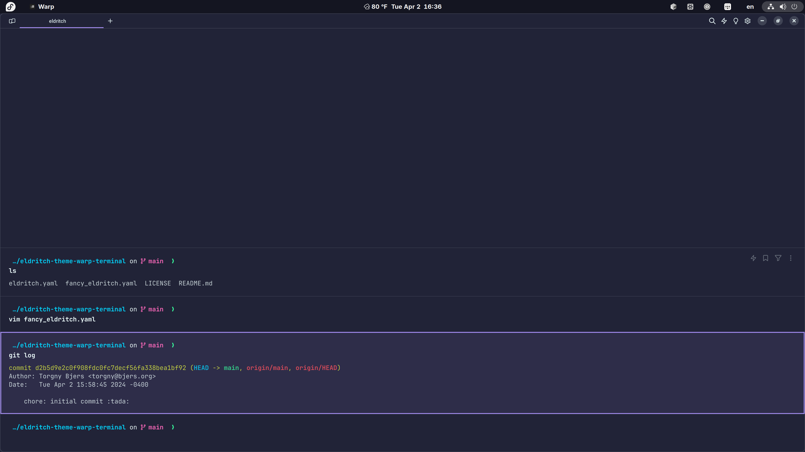
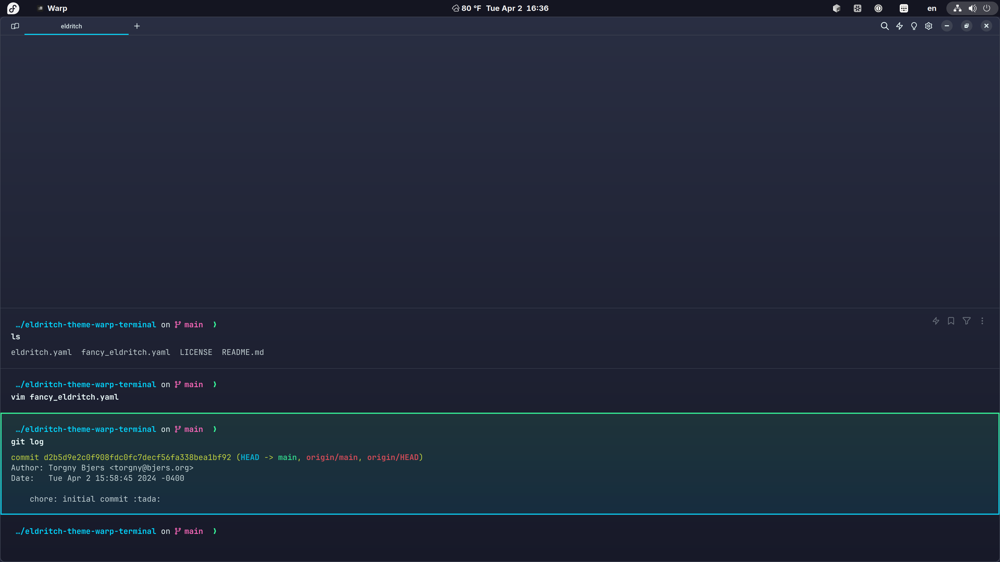
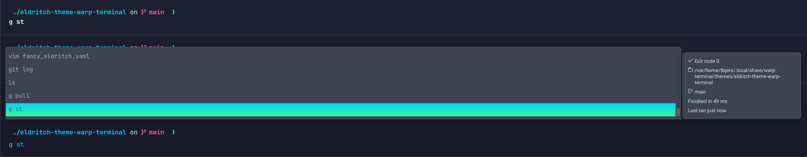

<!-- DO NOT CHANGE THIS -->
<p align="center">

</p>
<p>
Eldritch is a community-driven dark theme inspired by Lovecraftian horror. With tones from the dark abyss and an emphasis on green and blue, it caters to those who appreciate the darker side of life.
</p>

Main Theme repo can be found [here](https://github.com/eldritch-theme/eldritch)

### Showcase

<!-- Your screenshot should go here -->

**Eldritch** for Warp Terminal:

<br/>

**Fancy Eldritch** for Warp Terminal:

<br/>

Example of Warp Terminal row highlight:

<br/>

### Installation

The easiest way to install this theme is to clone the repository into the `themes` directory of Warp.

1. Set up an environment variable to make life easier:

```bash
# Mac
export WARP_THEME_DIR="${HOME}/.warp/themes"
# Linux
export WARP_THEME_DIR="${XDG_DATA_HOME:-$HOME/.local/share}/warp-terminal/themes"
```

2. Install the theme:

```bash
mkdir -p "${WARP_THEME_DIR}" && \
  git clone --depth=1 https://github.com/eldritch-theme/warp.git \
  "${WARP_THEME_DIR}/eldritch"
```

3. Configure Warp to use either `Eldritch` or `Fancy Eldritch`.
