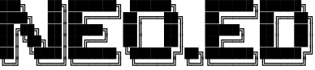

# dotfiles/nvim/.config/nvim



<a href="https://dotfyle.com/edheltzel/dotfiles-nvim-config-nvim"></a>
<a href="https://dotfyle.com/edheltzel/dotfiles-nvim-config-nvim"></a>
<a href="https://dotfyle.com/edheltzel/dotfiles-nvim-config-nvim"></a>

## Install Instructions

 > Install requires Neovim 0.9+. Always review the code before installing a configuration.

Clone the repository and install the plugins:

```sh
git clone git@github.com:edheltzel/dotfiles ~/.config/edheltzel/dotfiles
```

Open Neovim with this config:

```sh
NVIM_APPNAME=edheltzel/dotfiles/nvim/.config/nvim nvim
```

## Plugins

### ai

+ [supermaven-inc/supermaven-nvim](https://dotfyle.com/plugins/supermaven-inc/supermaven-nvim)

### colorscheme

+ [catppuccin/nvim](https://dotfyle.com/plugins/catppuccin/nvim)
+ [eldritch-theme/eldritch.nvim](https://dotfyle.com/plugins/eldritch-theme/eldritch.nvim)
+ [folke/tokyonight.nvim](https://dotfyle.com/plugins/folke/tokyonight.nvim)
+ [craftzdog/solarized-osaka.nvim](https://dotfyle.com/plugins/craftzdog/solarized-osaka.nvim)
+ [rose-pine/neovim](https://dotfyle.com/plugins/rose-pine/neovim)

### editing-support

+ [folke/snacks.nvim](https://dotfyle.com/plugins/folke/snacks.nvim)

### file-explorer

+ [nvim-neo-tree/neo-tree.nvim](https://dotfyle.com/plugins/nvim-neo-tree/neo-tree.nvim)

### keybinding

+ [folke/which-key.nvim](https://dotfyle.com/plugins/folke/which-key.nvim)

### lua-colorscheme

+ [ellisonleao/gruvbox.nvim](https://dotfyle.com/plugins/ellisonleao/gruvbox.nvim)

### motion

+ [sphamba/smear-cursor.nvim](https://dotfyle.com/plugins/sphamba/smear-cursor.nvim)

### plugin-manager

+ [folke/lazy.nvim](https://dotfyle.com/plugins/folke/lazy.nvim)

### preconfigured

+ [LazyVim/LazyVim](https://dotfyle.com/plugins/LazyVim/LazyVim)

## Language Servers

 This readme was generated by [Dotfyle](https://dotfyle.com)
